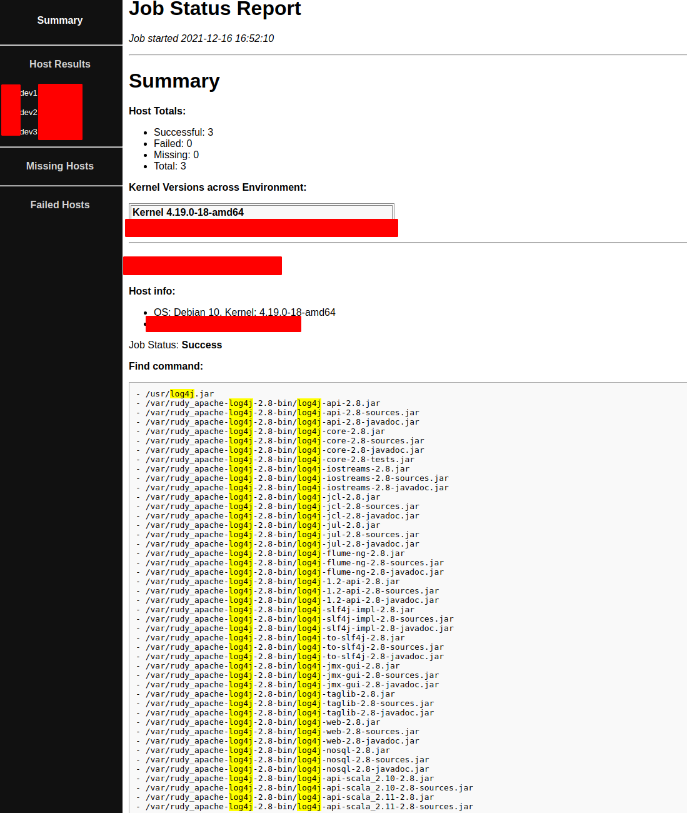

# A very simple log4j detector with Ansible with an even simpler html report page

Requirements:
- ansible
- jmespath (`pip3 install jmespath`)

How to run:

```
ansible-playbook  -u <remote-user> -i <inventory-file> job_report.yaml
```
Based on https://github.com/jwkenney/ansible-job-report for the reporting overview


